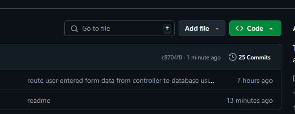
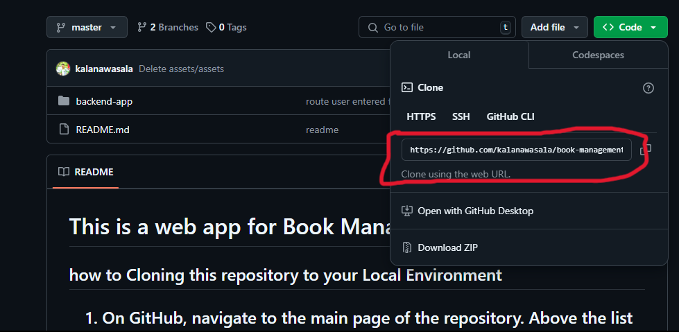

<h1>This is a web app for Book Management System </h1>
<h3>how to Cloning this repository to your Local Environment </h3>
    
    First navigate to the Code Button And click on it to open clone path
  
    
     After that you have to copy the clone path

  
    Then you have to make a new directory in your local enviornmet and change your current direct to that directory
    In the terminal, navigate to the current place to download the repo into and clone it:
    git clone <PASTE THE REPO ADDRESS HERE>.git
    
<h1>Done After that You can used this repo</h1>
